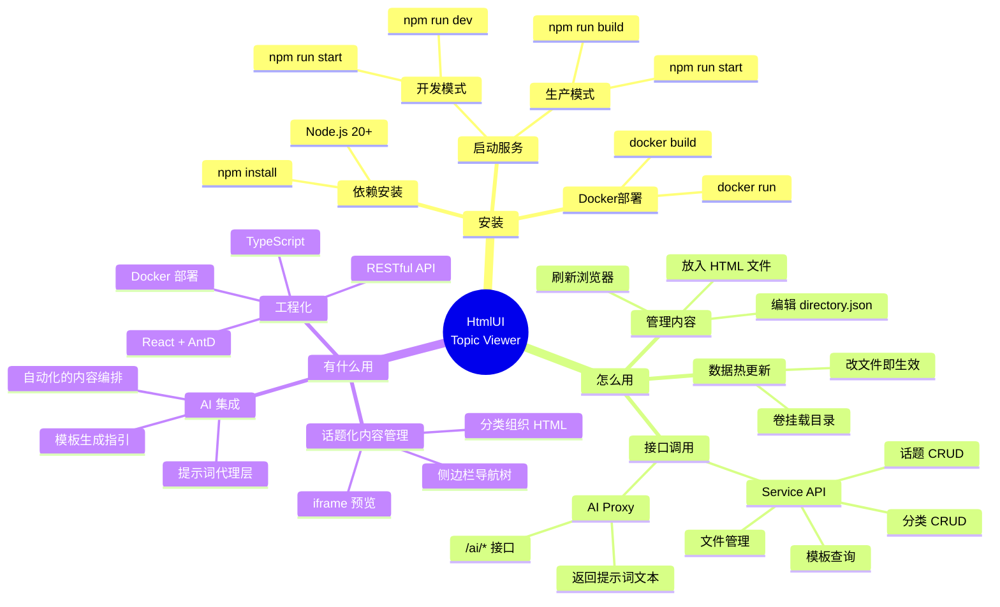
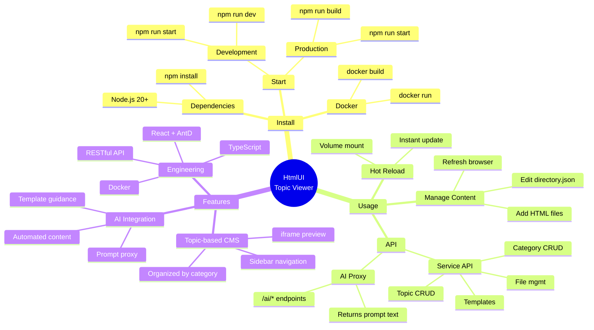

<div align="center">

[🇨🇳 中文](#chinese) · [🇬🇧 English](#english)

</div>

---

## <a name="chinese"></a>🇨🇳 中文

# HtmlUI Topic Viewer



### 安装

**环境要求：** Node.js 20+

```bash
# 克隆项目
git clone https://github.com/yuanxin518/HtmlUI-issue-viewer.git
cd HtmlUI-issue-viewer

# 安装依赖
npm install
```

#### 启动服务

```bash
# 开发模式（前端 :1233，后端 :1234）
npm run dev        # 启动 Vite 前端开发服务器
npm run start      # 启动 Express API 服务器

# 生产模式
npm run build      # 构建前端静态资源
npm run start      # 统一在 :1234 端口提供服务
```

#### Docker 部署

```bash
docker build -t topic-viewer .
docker run -d -p 1234:1234 \
  -v $(pwd)/data/directory.json:/app/data/directory.json \
  -v $(pwd)/data/topics:/app/data/topics \
  topic-viewer
```

### 怎么用

#### 添加话题内容

系统通过 `data/` 目录管理所有运行时内容，无需重启服务：

```
data/
├── directory.json     # 编辑此文件管理分类和话题列表
└── topics/            # 存放 HTML 话题文件
    ├── example-1.html
    └── example-2.html
```

```bash
# 1. 放入 HTML 文件
cp output.html data/topics/my-topic.html

# 2. 编辑目录配置
vim data/directory.json

# 3. 浏览器刷新即可看到新话题
```

**directory.json 格式：**
```json
{
  "categories": [
    {
      "name": "分类名称",
      "icon": "FolderOpenOutlined",
      "topics": [
        { "id": "topic-id", "title": "话题标题", "file": "文件名.html" }
      ]
    }
  ]
}
```

#### 调用 API

系统提供两层 API：

| 层 | 路径 | 用途 |
|----|------|------|
| Service API | `/api/*` | 返回 JSON 数据，供前端或脚本调用 |
| AI Proxy | `/ai/*` | 返回 Markdown 提示词，供 AI 模型调用 |

```bash
# 获取话题列表
curl http://localhost:1234/api/categories

# 获取模板详情提示词（AI 可用此生成 HTML）
curl http://localhost:1234/ai/templates/tech-doc

# 查看所有 AI 接口
curl http://localhost:1234/ai
```

#### 模板使用

系统内置三种话题模板，可调用 AI 接口获取 HTML 生成指引：

```bash
curl http://localhost:1234/ai/templates/tech-doc    # 技术文档
curl http://localhost:1234/ai/templates/review-doc   # 代码审查报告
curl http://localhost:1234/ai/templates/note-doc     # 知识笔记
```

### 有什么用

- **话题化组织** — 以分类和话题的方式管理 HTML 内容，侧边栏导航清晰，适合文档站、知识库、作品集等场景。
- **AI 辅助生成** — AI Proxy 层提供提示词接口，AI 模型可直接调用生成符合模板风格的 HTML 页面，减少重复工作。
- **热更新** — 数据目录通过 Docker 卷挂载，添加或修改文件后刷新浏览器即生效，无需重启容器或重建镜像。
- **工程化** — 基于 React 18 + Ant Design + TypeScript 构建，后端使用 Express，支持 Docker 一键部署。

---

## <a name="english"></a>🇬🇧 English

# HtmlUI Topic Viewer



### Install

**Prerequisites:** Node.js 20+

```bash
git clone https://github.com/yuanxin518/HtmlUI-issue-viewer.git
cd HtmlUI-issue-viewer
npm install
```

#### Start

```bash
# Development (frontend :1233, backend :1234)
npm run dev       # Vite dev server
npm run start     # Express API server

# Production
npm run build     # Build frontend assets
npm run start     # Unified on :1234
```

#### Docker

```bash
docker build -t topic-viewer .
docker run -d -p 1234:1234 \
  -v $(pwd)/data/directory.json:/app/data/directory.json \
  -v $(pwd)/data/topics:/app/data/topics \
  topic-viewer
```

### Usage

#### Manage Topics

All runtime data lives in `data/` — no restart required:

```
data/
├── directory.json     # Category and topic configuration
└── topics/            # HTML topic files
```

```bash
# 1. Place an HTML file
cp output.html data/topics/my-topic.html

# 2. Edit the directory config
vim data/directory.json

# 3. Refresh browser
```

**directory.json format:**
```json
{
  "categories": [
    {
      "name": "Category Name",
      "icon": "FolderOpenOutlined",
      "topics": [
        { "id": "topic-id", "title": "Topic Title", "file": "file.html" }
      ]
    }
  ]
}
```

#### API

Two API layers are available:

| Layer | Path | Purpose |
|-------|------|---------|
| Service API | `/api/*` | Returns JSON for frontend or scripts |
| AI Proxy | `/ai/*` | Returns Markdown prompts for AI agents |

```bash
# List topics
curl http://localhost:1234/api/categories

# Get template prompt (AI uses this to generate HTML)
curl http://localhost:1234/ai/templates/tech-doc

# List all AI endpoints
curl http://localhost:1234/ai
```

#### Templates

Three built-in templates for AI-assisted HTML generation:

```bash
curl http://localhost:1234/ai/templates/tech-doc    # Technical docs
curl http://localhost:1234/ai/templates/review-doc   # Code review
curl http://localhost:1234/ai/templates/note-doc     # Knowledge notes
```

### Features

- **Topic-based CMS** — Organize HTML content by category with sidebar navigation. Suitable for documentation hubs, knowledge bases, and portfolios.
- **AI-assisted generation** — AI Proxy layer provides prompt endpoints. AI models can call these to generate template-styled HTML pages, reducing repetitive work.
- **Hot reload** — Data directory is volume-mounted in Docker. Add or modify files, refresh the browser — no container restart or image rebuild needed.
- **Engineering** — Built with React 18 + Ant Design + TypeScript, backed by Express, one-command Docker deployment.

---

<div align="center">MIT License</div>
